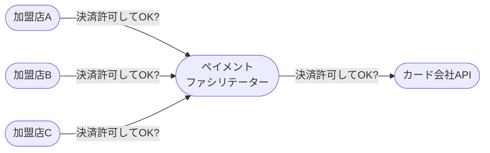
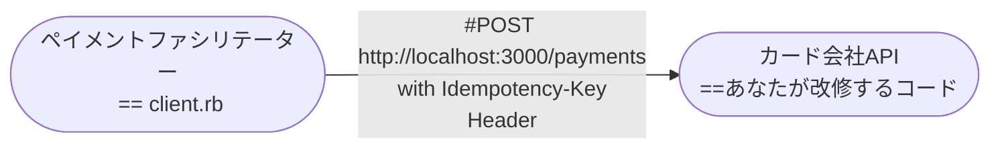

# CTOを破産から救おうチャレンジ

## あらすじ

2024年新春、YAPC::Hiroshimaのスポンサーとなった[株式会社スマートバンク](https://smartbank.co.jp/)はイベントを最大限に盛り上げるため、広島のお食事どころ紹介企画を行っています。参加者の皆様にはグルメマップをノベルティとして配布していますのでぜひご覧ください。

さて、当企画にあたりスマートバンクCTO [@yutadayo](https://twitter.com/yutadayo) は広島の飲食店を練り歩いたのですが...困ったことが起きました。カード決済ネットワークの途中で障害が起き、**飲食店からカード会社への決済リクエストが何重にもリトライ送信されてしまった**のです。

もし全てのリクエストがカード会社で処理されたら...口座残高がなくなりスマートバンクCTOは破産に追い込まれてしまいます。重複リクエストを適切にさばくプログラムを記述して**CTOを破産から救いましょう！**

## 想定回答時間

10~20分

## やってみる

何はともあれ、さっそくチャレンジしてみましょう。

```shell
git clone https://github.com/smartbank-inc/yapc2024-quiz
cd yapc2024-quiz
make run
```

`make run`を実行すると[Docker Compose](https://docs.docker.com/compose/)により http://localhost:3000 でリクエストを待ち受けるHTTPサーバーが起動し、`client/client.rb`から同サーバーへの決済リクエストが行われます。ターミナルにあなたの回答や採点結果が表示されれば正常に動いています。


初期実装ではすべての決済リクエストを許可しているのでCTOは破産してしまいます🥲
**重複したリクエストを処理しないようにサーバープログラムを改修**して、残高をプラスに保ちつつ訪問したお店が正しく記録されるようにできればチャレンジ成功です。

### 使用言語について

Ruby, Go, Perlの3種類の実装をそれぞれ`api-ruby/app.rb`, `api-go/app.go`, `api-perl/app.pl`として用意しています。任意の言語を指定してサーバ起動を行う場合は以下のコマンドが利用できます。

```shell
make run-ruby # `make run`では`run-ruby`が実行されます
make run-go
make run-perl
```

いずれの言語でも`docker compose logs`でサーバーのログを見ることができます。

## 仕様

カード決済の仕組みを簡略化すると以下のようになります。



今回のクイズでは[ペイメントファシリテーター](https://stripe.com/ja-us/guides/payfacs)に相当するのが`client/client.rb`となり、改修してもらうのはなぜかあなたの手元にあるカード会社APIのプログラム（`api-xxx/`のコード）です。



今回のシナリオでは加盟店またはペイメントファシリテーターのいずれかに障害があり、カード会社サーバーへ大量のリクエストが飛んできます。

### Idempotency-Keyヘッダーについて

障害は悲しいことですが、幸いにも、ペイメントファシリテーターからの決済リクエストには`Idempotency-Key: {UUID}`のヘッダーが付与されています[^1]。
このHTTPヘッダーはリクエストの同一性を示すもので、受け取ったサーバーには以下の振る舞いが期待されます。

- 同じ値を持つリクエストを複数回受け取ったサーバーは最初の1回のみリクエストのみ処理し、後続のリクエストでは処理を行ってはいけません。
- Idempotency-Keyヘッダーを受け付けるAPIエンドポイントは、このヘッダーが付与されていないリクエストを処理してはいけません。

[^1]: api-rubyの場合はRackによって`HTTP_IDEMPOTENCY_KEY`という形式に変換されます。

上記仕様を満たす実装を完成させてCTOを救えたらクリアです 🎉

### クリア後コンテンツ

さらに高みを目指したい方は以下の条件を満たす実装に挑戦してみましょう！正しく実装できると**ハードモードクリア**と認定され、採点結果が変わります。

- サーバ側で既知のidempotency keyに対して以前と異なるリクエストボディが送信された場合、サーバーはHTTPステータスコード422 Unprocessable Entityを返します。

```shell
# 初回のリクエストにて以下のリクエストボディを送信したとします。
curl -X POST -d '{"amount": 1000, "shop_name": "Chef The Okonomiyami"}' -H "Idempotency-Key: 362b327e-50a8-4074-a182-3f1016283ac2"

# もし同じIdempotency-Keyにも関わらず、以下のような異なるリクエストボディが送信された場合は422を返しましょう。
curl -X POST -d '{"amount": 2000, "shop_name": "Chef The Okonomiyami"}' -H "Idempotency-Key: 362b327e-50a8-4074-a182-3f1016283ac2"
```

## 注意事項

- この物語はフィクションであり、実在の人物・団体とは一切関係ありません。
- このクイズはIdempotency-Keyヘッダーのコンセプトとカード決済の雰囲気を理解していただくためのものです。
  - 提案仕様に追従・準拠したものではありません。
  - Idempotency-Keyヘッダーを使わずにプログラムを変更して破産を避けることもできますが、せっかくなので使ってみましょう！
- 実際のカード決済のリクエスト（オーソリゼーション）はIdempotency-Key Headerとは異なる仕組みで冪等性を保っています。興味がある方はスマートバンク社員をつかまえて聞いてみてください。
- 実際のカード決済は遥かに複雑です。入門には「[B/43カード決済システムのしくみ（前編）](https://blog.smartbank.co.jp/entry/2022/02/28/about-card-payment-system)」がおすすめです。

## スマートバンクについて

- [スマートバンク - エンジニアポジションに興味がある方へ](https://smartbank.co.jp/recruit/engineer-summary)
- [スマートバンク - Recruiting Deck](https://speakerdeck.com/smartbank/smartbank-recruiting-deck)

## ギャラリー

_グルメマップキービジュアル_


_ありえるかもしれない未来_


